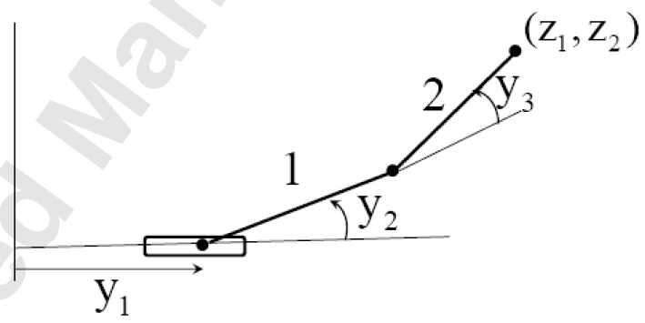
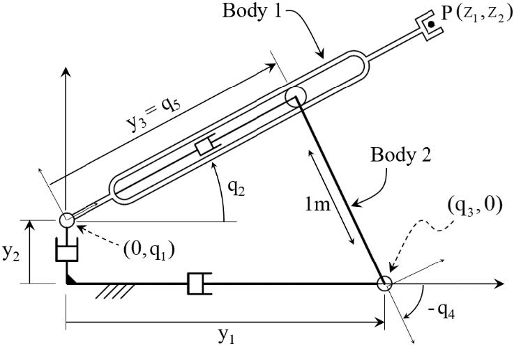

# 9. Manipulator Kinematics and Dynamics

## Kinematically Redundant Serial Manipulators

$$
\mathbf{G}(\mathbf{y})=\left[\begin{array}{c}
y_1+\cos y_2+2 \cos \left(y_2+y_3\right) \\
\sin y_2+2 \sin \left(y_2+y_3\right)
\end{array}\right]\\
\mathbf{G}^{\prime}(\mathbf{y}) =\left[\partial \mathrm{G}_{\mathrm{i}}(\mathbf{y}) / \partial \mathrm{y}_{\mathrm{j}}\right]
 =\left[\begin{array}{ccc}
1 & -\sin \mathrm{y}_2-2 \sin \left(\mathrm{y}_2+\mathrm{y}_3\right) & -2 \sin \left(\mathrm{y}_2+\mathrm{y}_3\right) \\
0 & \cos \mathrm{y}_2+2 \cos \left(\mathrm{y}_2+\mathrm{y}_3\right) & 2 \cos \left(\mathrm{y}_2+\mathrm{y}_3\right)
\end{array}\right]\\
$$

$$
\mathbf{U}=\mathbf{G}^{\prime T}(\overline{\mathbf{y}})\\
\mathbf{G}^{\prime}(\overline{\mathbf{y}})\mathbf{V}=0\\
\mathbf{y}=\overline{\mathbf{y}}+\mathbf{Vv}-\mathbf{Uu}\\
\mathbf{G}(\overline{\mathbf{y}}+\mathbf{Vv}-\mathbf{Uu})-\mathbf{z}=0\\
\mathbf{y(v,z)}=\overline{\mathbf{y}}+\mathbf{Vv}-\mathbf{Uh(v,z)}\\
\mathbf{G}^{\prime}(\mathbf{y})(\mathbf{V}-\mathbf{Uh_v})=0\\
\mathbf{G}^{\prime}(\mathbf{y})(-\mathbf{Uh_z})-\mathbf{I}=0\\
\mathbf{B}(\mathbf{y}) \equiv\left(\mathbf{G}^{\prime}(\mathbf{y}) \mathbf{U}\right)^{-1}\\
\mathbf{h_v}=\mathbf{B}(\mathbf{y})\mathbf{G}^{\prime}(\mathbf{y})\mathbf{V}\\
\mathbf{h_z}=-\mathbf{B}(\mathbf{y})\\
\mathbf{y}_{\mathbf{v}}(\mathbf{v}, \mathbf{z})=\mathbf{V}-\mathbf{U B}(\mathbf{y}(\mathbf{v}, \mathbf{z})) \mathbf{G}^{\prime}(\mathbf{y}(\mathbf{v}, \mathbf{z})) \mathbf{V} \\
\mathbf{y}_{\mathbf{z}}(\mathbf{v}, \mathbf{z})=\mathbf{U B}(\mathbf{y}(\mathbf{v}, \mathbf{z}))\\
$$

## Kinematically Redundant Compound Manipulators

$$
\text{holonomic constraints} & \mathbf{\Phi}(\mathbf{q})=\mathbf{0}\\
\text{input equations} & \mathbf{\Psi}(\mathbf{y},\mathbf{q})=\mathbf{0}\\
\text{output equations} & \mathbf{\Gamma}(\mathbf{q},\mathbf{z})=\mathbf{0}\\
$$

### Compound Manipulator Configuration Space

$$
\mathbf{\Omega}(\mathbf{y},\mathbf{q})
=\left[\begin{array}{c}
\boldsymbol{\Phi}(\mathbf{q}) \\
\boldsymbol{\Psi}(\mathbf{y}, \mathbf{q})
\end{array}\right]=\mathbf{0} \\
|\mathbf{\Omega}_{\mathbf{q}}(\mathbf{y},\mathbf{q})|\not=0\Rightarrow\mathbf{q}=\mathbf{f}(\mathbf{y})\\
|\mathbf{\Gamma}_{\mathbf{z}}(\mathbf{q},\mathbf{z})|\not=0\Rightarrow\mathbf{z}=\mathbf{e}(\mathbf{q})\\
\mathbf{z}=\mathbf{e}(\mathbf{f}(\mathbf{y}))=\mathbf{G}(\mathbf{y})
$$

$$
\mathbf{\Lambda}(\mathbf{q},\mathbf{z})
=\left[\begin{array}{c}
\boldsymbol{\Phi}(\mathbf{q}) \\
\boldsymbol{\Gamma}(\mathbf{q}, \mathbf{z})
\end{array}\right]=\mathbf{0} \\
$$

### Regular Compound Manipulator Configuration Space

### Compound Manipulator Inverse Kinematic Configuration Mapping

$$
\mathbf{U}=\Lambda_\mathbf{q}^\mathrm{T}(\mathbf{q},\mathbf{z})\\
\mathbf{U}^\mathrm{T}\mathbf{V}=\mathbf{0},\mathbf{V}^\mathrm{T}\mathbf{V}=\mathbf{I}\\
\mathbf{q}=\mathbf{q}^0+\mathbf{Vv}-\mathbf{Uu}\\
$$

### Parameterization of the Regular Compound Manipulator Configuration Space

$$
\mathbf{G}(\overline{\mathbf{y}}+\mathbf{Vv}-\mathbf{Uu})-\mathbf{z}=0\\
\mathbf{y(v,z)}=\overline{\mathbf{y}}+\mathbf{Vv}-\mathbf{Uh(v,z)}\\
\mathbf{G}^{\prime}(\mathbf{y})(\mathbf{V}-\mathbf{Uh_v})=0\\
\mathbf{G}^{\prime}(\mathbf{y})(-\mathbf{Uh_z})-\mathbf{I}=0\\
\mathbf{B}(\mathbf{y}) \equiv\left(\mathbf{G}^{\prime}(\mathbf{y}) \mathbf{U}\right)^{-1}\\
\mathbf{h_v}=\mathbf{B}(\mathbf{y})\mathbf{G}^{\prime}(\mathbf{y})\mathbf{V}\\
\mathbf{h_z}=-\mathbf{B}(\mathbf{y})\\
\mathbf{y}_{\mathbf{v}}(\mathbf{v}, \mathbf{z})=\mathbf{V}-\mathbf{U B}(\mathbf{y}(\mathbf{v}, \mathbf{z})) \mathbf{G}^{\prime}(\mathbf{y}(\mathbf{v}, \mathbf{z})) \mathbf{V} \\
\mathbf{y}_{\mathbf{z}}(\mathbf{v}, \mathbf{z})=\mathbf{U B}(\mathbf{y}(\mathbf{v}, \mathbf{z}))\\
$$

$$
\mathbf{\Phi}(\mathbf{q})=\left[\begin{array}{c}
q_5\cos q_2-q_3+\cos q_4 \\
q_1+q_5\sin q_2+\sin q_4
\end{array}\right]=\mathbf{0}\\
\mathbf{\Psi}(\mathbf{y},\mathbf{q})=\left[\begin{array}{ccc}
q_3-y_1 & q_1-y_2 & q_5-y_3\end{array}\right]^\mathbf{T}=\mathbf{0}\\
\mathbf{\Gamma}(\mathbf{q},\mathbf{z})=\left[\begin{array}{ccc}
2\cos q_2-z_1 & q_1+2\sin q_2-z_2\end{array}\right]^\mathbf{T}=\mathbf{0}\\
$$

$$
\mathbf{\Omega}_\mathbf{q}(\mathbf{y},\mathbf{q})
=\left[\begin{array}{c}
\boldsymbol{\Phi}_{\mathbf{q}}(\mathbf{q}) \\
\boldsymbol{\Psi}_{\mathbf{q}}(\mathbf{y}, \mathbf{q})
\end{array}\right]
={\left[\begin{array}{ccccc}
0 & -\mathrm{q}_5 \sin \mathrm{q}_2 & -1 & -\sin \mathrm{q}_4 & \cos \mathrm{q}_2 \\
1 & \mathrm{q}_5 \cos \mathrm{q}_2 & 0 & \cos \mathrm{q}_4 & \sin \mathrm{q}_2 \\
0 & 0 & 1 & 0 & 0 \\
1 & 0 & 0 & 0 & 0 \\
0 & 0 & 0 & 0 & 1
\end{array}\right]}\\
\Lambda_{\mathbf{q}}(\mathbf{q}, \mathbf{z})=\left[\begin{array}{c}
\boldsymbol{\Phi}_{\mathbf{q}}(\mathbf{q}) \\
\boldsymbol{\Gamma}_{\mathbf{q}}(\mathbf{q}, \mathbf{z})
\end{array}\right]=\left[\begin{array}{ccccc}
0 & -\mathrm{q}_5 \sin \mathrm{q}_2 & -1 & -\sin \mathrm{q}_4 & \cos \mathrm{q}_4 \\
1 & \mathrm{q}_5 \cos \mathrm{q}_2 & 0 & \cos \mathrm{q}_4 & \sin \mathrm{q}_4 \\
0 & -2 \sin \mathrm{q}_2 & 0 & 0 & 0 \\
1 & 2 \cos \mathrm{q}_2 & 0 & 0 & 0
\end{array}\right]
$$

